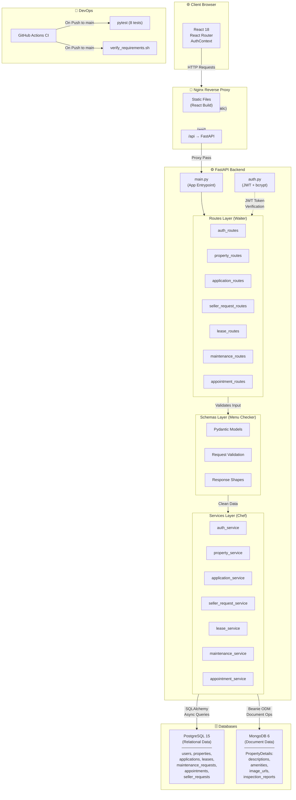
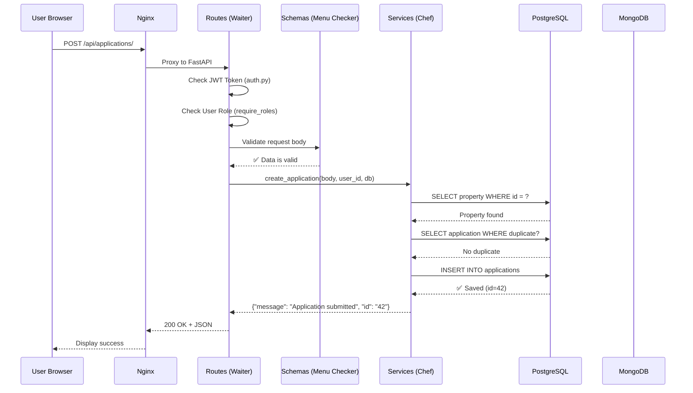
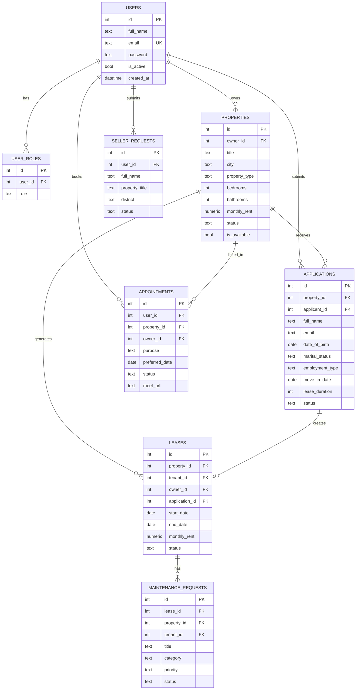

# PropertyNest — Architecture

## System Architecture Diagram



## Data Flow — How a Request Travels



## Database Schema — PostgreSQL



## MongoDB Document Structure

```json
{
  "_id": "ObjectId",
  "property_id": "42",
  "description": "Spacious 2BHK apartment with city view...",
  "amenities": ["WiFi", "Parking", "Gym", "Swimming Pool"],
  "image_urls": ["/uploads/property_images/uuid_photo.jpg"],
  "inspection_reports": []
}
```

> **Why two databases?**  
> PostgreSQL stores structured, relational data (users, properties, leases) where strict schemas and foreign key relationships matter.  
> MongoDB stores flexible, variable-length data (property descriptions, amenities lists, image galleries) where each property may have wildly different content.
